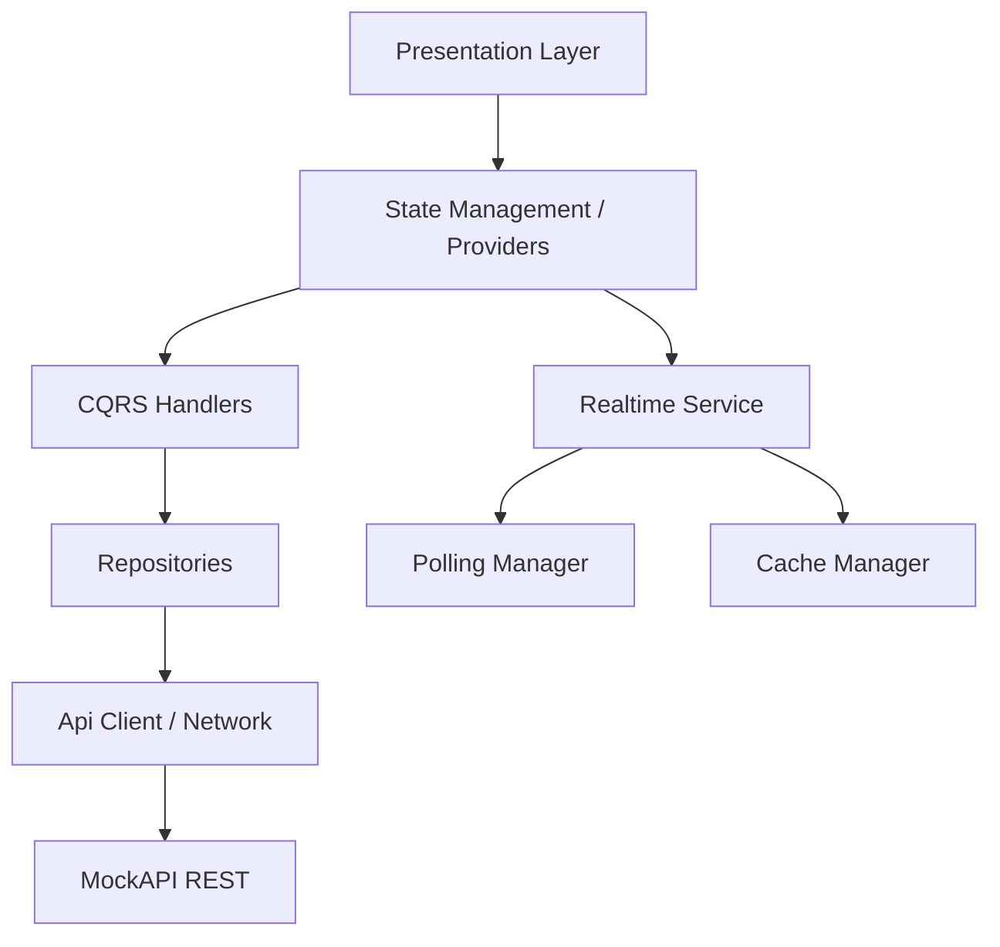
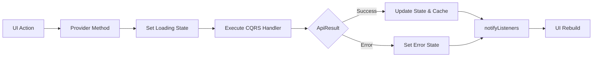
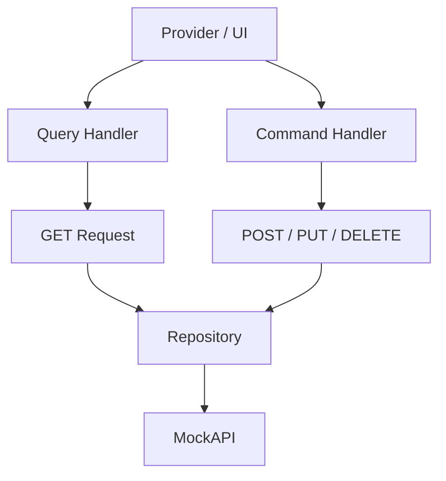
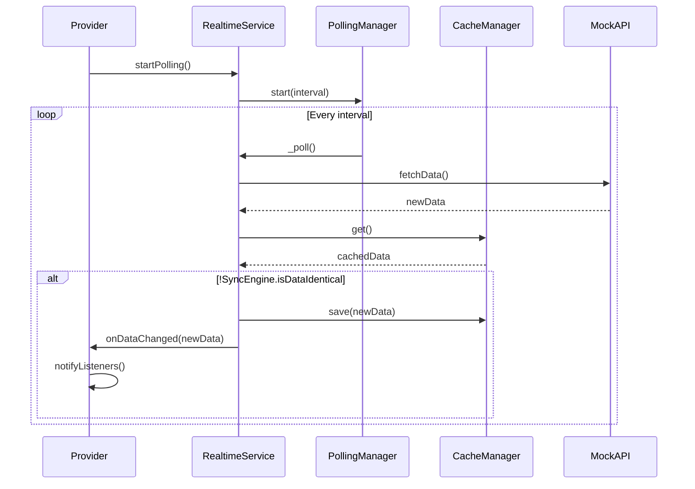
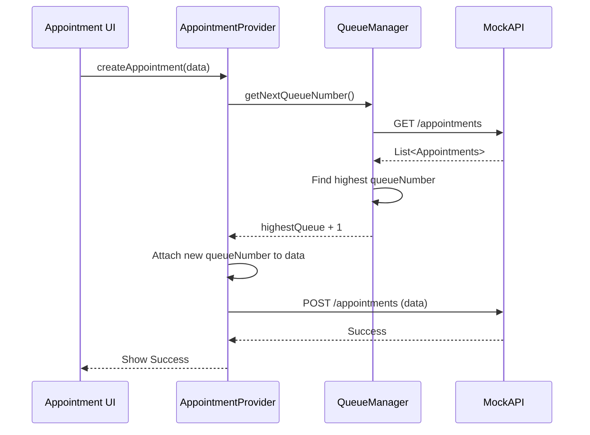
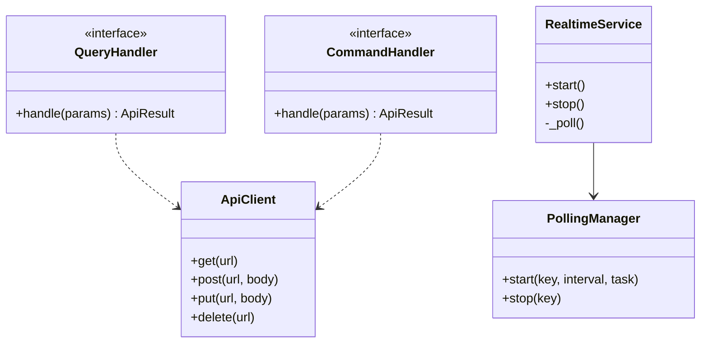

# E-Health Enterprise Application

This project is an enterprise-grade refactoring of the Poliklinik application. It adheres to Clean Architecture, CQRS, and advanced State Management using Provider, all while being powered entirely by MockAPI.

## Features Added During Refactoring
* **Clean Architecture Folder Structure**
* **Dynamic API Endpoint Resolver**
* **API Interceptors & Result Handling**
* **Real-time Synchronization via Polling**
* **Intelligent Data Caching & Diff Checking**
* **Queue Management System (Persistent)**
* **CQRS Pattern Implementation**
* **Smart Debounced Search for Doctors & Medicines**

---

## Diagrams

### 1. Architecture Diagram


### 2. Provider Flow


### 3. CQRS Diagram


### 4. Polling Flow


### 5. Queue Synchronization Diagram


### 6. Folder Structure
```text
lib/
├── core/
│   ├── cqrs/
│   └── utils/
├── config/
├── network/
├── services/
├── realtime/
├── cache/
├── repositories/
├── providers/
├── models/
├── entities/
└── presentation/
    ├── screens/
    ├── widgets/
    └── shared/
```

### 7. Class Diagram (Core Network & CQRS)

